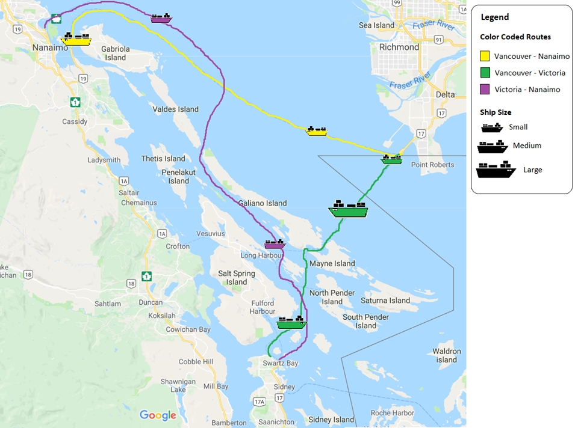

Activity 2
==============

Description
-----------

Design Mockup
-------------

What-Why-How
------------
### What
* Dataset: Networks (items, links, attributes).
* Data Types: 
	* Items: the berths (nodes) that contain instances of the attributes.
	* Links: routes (connections) between berths (nodes).
	* Attributes: info at each node such as ship id, max ship capacity, actual ship capacity, departure time, 
		arrival time, route, departure berth, arrival berth, ifDelayed.

* Dataset Availability: Dynamic so that we can have updating vessel information.
* Attribute Types:
	* Categorical: the berths are unique and have no ranking properties
	* Ordered:
		* Ordinal: the vessels have varying capacities and can be arranged as such.
		* Quantitative: calculating the max ship capacity and actual ship capacity after departure.
	* Diverging: routes go both directions between berths
	* Cyclic: hours in a day cycle and days in the week cycle for scheduling purposes

### Why
Actions
* Analyze:
	* consume: discover where vessels currently are, and the departure and arrival times. 
	* present: the design will be used to communicate information that is already know to the user. For example, the departure and arrival times. 
	* produce: use the information about how many passengers are on each vessel, and change schedules accordingly.

Targets
* Trends: Can notice that on specific days , or during specific hours of the day more people use the ferries. So for these times, they would need longer schedules for the day.
* Netwrok Data: berths = nodes, routes = paths betwenn nodes.
### How

Design Study Methodology
------------------------
### Learn
Learn about what current methods exist that would be helpeful in solving this problem ...

### Pitfalls

